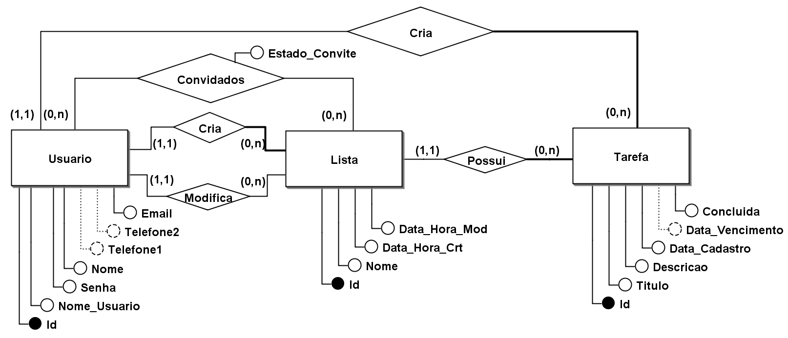

# To-Do List DB
Projeto To-Do compartilhada utilizando o banco de dados MySql.
--

    Uma lista de tarefas é uma ferramenta poderosa e versátil que oferece uma variedade de funcionalidades para ajudar os usuários a gerenciar suas tarefas de forma eficiente. Dessa forma, você e seus colegas, decidiram utilizar uma lista de tarefas compartilhadas para que, além de cada um poder organizar as suas próprias tarfeas, vocês também pudessem editar listas de tarefas compartilhas entre vocês para se organizarem em relação as atividades em grupo, como tarefas na universidade e estágio.

    No entanto, ao pesquisarem por aplicações de listas de tarefas compartilhadas, vocês não encontraram nenhuma aplicação disponível que atendesse às suas necessidades e que fosse segura o suficiente para confiarem os seus dados.

    Como todos têm os conhecimentos necessários para o desenvolvimentos de software, vocês decidiram criar uma aplicação própria de lista de tarefas compartilhada que, além de atender às necessidades do grupo, será disponibilizada para o público em geral que também buscam por uma ferramenta do tipo.

    Após discutirem sobre as funcionalidades que uma aplicação decente de lista de tarefas compartilhada deve oferecer, vocês elaboraram uma lista descrevendo essas funcionalidades e que serão implementadas pela aplicação de vocês. Abaixo, essas funcionalidades são apresentadas e descritas:

1. ***Cadastro e autenticação de usuários:*** A aplicação permite que os usuários se cadastrem, fornecendo um nome de usuário e senha, além de informações como nome, telefone, email. O cadastro é necessário para acessar todas as funcionalidades da aplicação. O acesso a aplicação será através do nome de usuário e senha.

2. ***Criação de listas de tarefas:*** Após acessar a aplicação, os usuários podem criar listas de tarefas para organizar suas atividades. Cada lista deve ter um nome descritivo para facilitar a identificação. Além disso, a aplicação deve ser capaz de apresentar a data e horário em que a lista foi criada e, também, a data e horário em que a última modificação na lista foi realizada (e o responsável pela modificação, no caso de listas compartilhadas).

3. ***Cadastro de tarefas:*** Dentro de cada lista de tarefas os usuários podem adicionar tarefas individuais. Cada tarefa deve conter uma descrição, data de cadastro, a data de vencimento da tarefa (opcional) e a indicação se a tarefa foi concluída ou não.

4. ***Compartilhamento de listas de tarefas:*** Os usuários têm a opção de convidar outros usuários para participarem da edição de suas listas de tarefas. Ao enviar um convite, o usuário convidado receberá uma notificação para aceitar ou recusar o acesso à lista de tarefas.

5. ***Aceitação ou recusa de convites:*** Os usuários podem visualizar os convites recebidos para participar de listas de tarefas compartilhadas. Eles têm a opção de aceitar o convite, o que permite que eles visualizem e editem a lista compartilhada, ou recusar o convite, caso não estejam interessados em participar.

6. ***Edição de listas compartilhadas:*** Tanto o usuário criador da lista quanto os usuários convidados podem editar as listas compartilhadas. Eles podem adicionar, remover ou modificar tarefas, permitindo a colaboração e atualização em tempo real.

7. ***Exclusão de listas de tarefas:*** Apenas o usuário criador da lista tem permissão para apagá-la. Essa funcionalidade garante que as listas compartilhadas não sejam excluídas acidentalmente por usuários convidados.

8. ***Listagem de listas de tarefas:*** A aplicação deve oferecer uma visão geral das listas de tarefas criadas pelo usuário, permitindo que ele as liste e selecione para visualização e edição.

9. ***Visualização e edição de listas de tarefas:*** Os usuários podem visualizar suas listas de tarefas e as listas compartilhadas. Eles têm a opção de marcar tarefas como concluídas e editar detalhes das tarefas.

    Essas funcionalidades essenciais garantem que os usuários tenham controle total sobre suas listas de tarefas e possam colaborar com outras pessoas quando necessário. A aplicação oferecerá uma experiência intuitiva e eficaz para o gerenciamento de tarefas, auxiliando na produtividade e organização pessoal.

**Tarefa 01.**

    Dada a especificação da aplicação acima, realize a modelagem conceitual, gerando como resultado um Diagrama Entidade Relacionamento (DER).

**Tarefa 02.**

    A partir do DER obtido na Tarefa 01, utilize as regras de mapeamento DER/Relacional para construção do modelo lógico relacional.

**Tarefa 03.**

    A partir do modelo lógico relacional obtido na Tarefa 02, escreva um script SQL para construção do esquema do banco de dados. Considere que será utilizado o SGBD MySQL para implantação da aplicação.

**Tarefa 04.**

    Implemente a aplicação especificada acima de forma que ela faça uso do banco de dados construído na Tarefa 03. Pode ser criada uma aplicação de terminal ou uma aplicação com interface gráfica (desktop ou Web). Essa escolha ficará a cargo do grupo de trabalho. A linguagem de programação também deve ser determinada pelo grupo.

**Tarefa 05.**

    Escreva um script SQL com todas as consultas utilizadas na implementação da aplicação.

